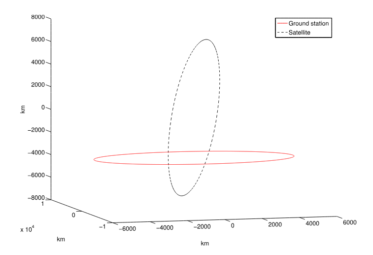
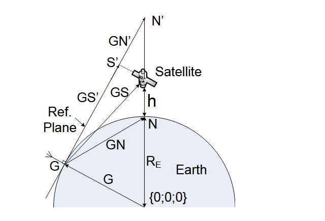
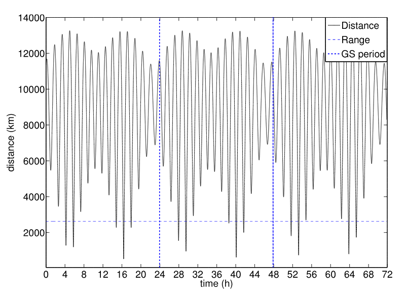
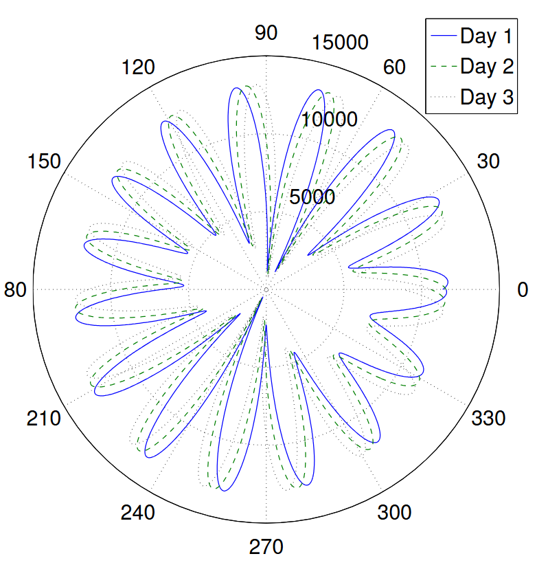
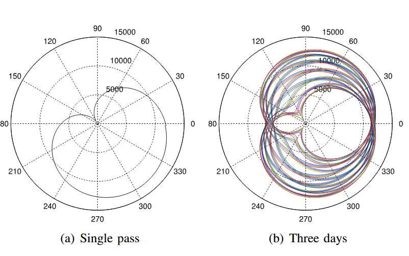
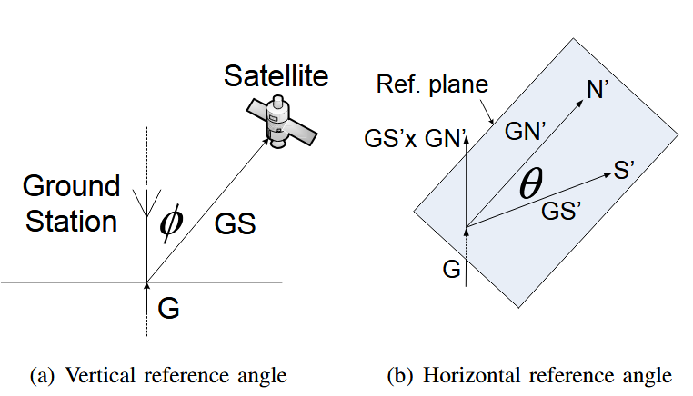
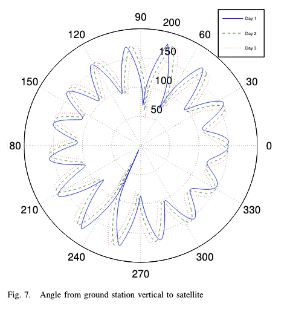
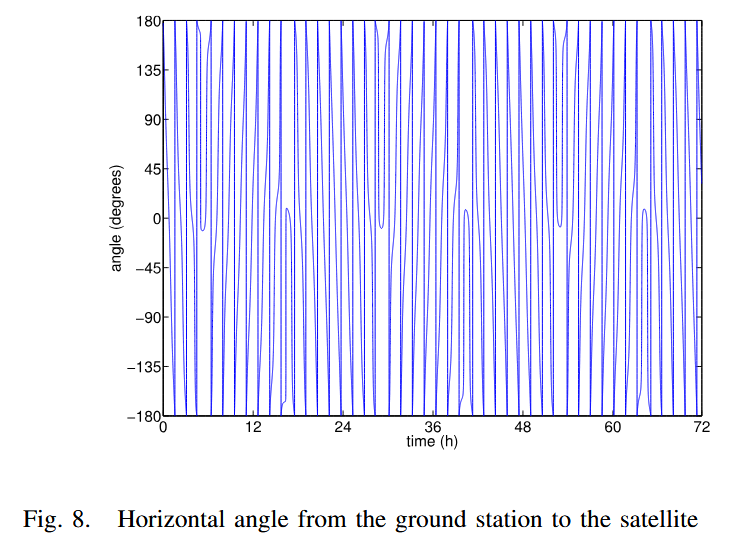
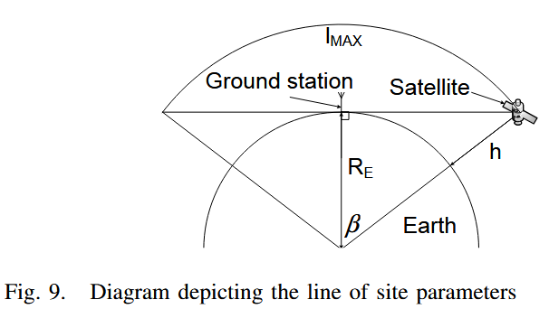
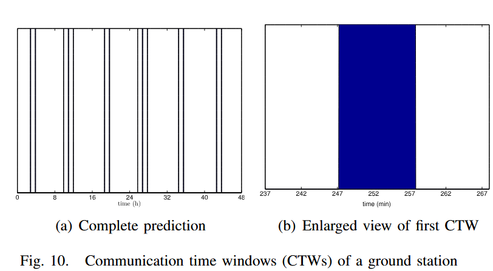

目前，地面站-卫星连接是在卫星进入地面站通信范围时建立的。地面站通过跟踪卫星来确定卫星何时在其范围内。地面站使用一个可操纵天线阵列，而卫星只有一个低增益全向天线[3]。其中一个例子就是“Leo One”小Leo卫星系统[4]。该方法实时建立链路，不考虑链路质量。卫星也不知道这个连接将持续多久。这种链路获取方法使自适应编码变得困难。

本文第二节是卫星轨道及时预报的方法。第三节说明了地面站如何也可以看作是一个随地球表面旋转的物体，并提出了预测的卫星和地面站轨道。第四节利用位置矢量作为时变矢量计算卫星与地面站之间的距离。然后，第五节计算地面站到卫星的垂直和水平时间变化角度。第六节说明如何利用距离和角度矢量来预测卫星能见度，以及如何推断链路质量。

## 卫星位置预测
链路质量与卫星和地面站之间的距离成正比。要计算卫星与地面站之间的距离，首先必须及时知道这些物体的位置。卫星在轨道上运行时所经历的轨道扰动（perturbations）使卫星轨道预测变得非常复杂。扰动的类型包括：地球的扁率、大气阻力、地球不规则的引力场、太阳辐射压力、月球和太阳的引力以及发动机推力。

目前，有一些算法可以用来及时预测卫星的轨道，并考虑到影响卫星轨道的各种力。对于轨道周期小于225 min的卫星，包括LEO卫星，大多采用SGP4传播器算法。该算法可以被认为精确到1km以内的位置，但精确程度随着使用的两线元集（Two-Line-Element set， TLE）的老化而下降。

TLE是一组值，它完全描述了卫星在某个时间的轨道测量值。可以从像Spacetrack这样的卫星跟踪组织下载TLEs。这些TLE被输入到NASA的SGP4卫星位置预测算法中以及时的预测卫星位置。通过主动跟踪卫星，并随着所测轨道参数的变化而更新卫星的TLE，使卫星的TLE保持最新状态。

对于本文所示的预测结果，实现了自定义卫星预测算法。值得注意的是，虽然预测卫星路径使用的算法精度较低，但该预测仅生成一个卫星位置向量，该位置向量可以通过SGP4算法轻松生成。重要的是如何使用这些向量来预测一段时间内的链路质量。

算法对偏心距为零的卫星轨道进行建模，也就是说，基于一个完美的圆形轨道。卫星位置向量$(\mathbf S)$为$3 \times K$ 矩阵，其中$K$为$K=t_{end}/t_{step}$给出的总迭代次数。其中$t_{end}$是预测的结束时间，单位是秒，$t_{step}$是步长时间。步长时间决定了预测的分辨率，使的所有位置向量在时间上有意义。

注：卫星的轨道轨迹必然是一组在某一时刻的位置坐标信息，K的意义是在$t_{step}$的步长下一段时间内需要计算出来的卫星位置的个数。

卫星轨道是通过使用$zy$平面内的初始点，用$s_0$表示,并围绕$x$轴旋转该点来创建的。静态旋转矩阵为

$$ Q=\begin{bmatrix}
1&0&0\\
0&cos(S_{step})&-sin(S_{step})\\
0&sin(S_{step})&cos(S_{step})\\
\end{bmatrix}\qquad(1) $$

这个矩阵绕$x$轴旋转到与它相乘的点。$S_{step}$是卫星矢量每一时间步长旋转的增量角度，表示如下：

$$ S_{step}=2\pi \frac{t_{step}}{T_s}\qquad(2) $$

其中$T_s$为卫星的周期。卫星周期可以用开普勒第三定律来计算，其中

$$ T_s=\sqrt \frac{4\pi^2(R_E+h)^3}{gR^2_E}\qquad(3) $$

$R_E$为地球平均半径，$h$ 为卫星高度，单位均为米，$g=9.81m/s^2$为海平面标称地球重力加速度。初始非倾斜卫星位置矢量由$\overrightarrow S_{0k}=\mathbf Q\overrightarrow S_{0(k-1)}=\mathbf Q^ks_0$给出。该方程的递归形式简化了计算，因为旋转矩阵是静态的。

为了创建一个倾斜的卫星轨道，围绕$y$轴进行另一个矢量旋转。旋转矩阵为:

$$ \mathbf L=\begin{bmatrix}
sin(i)&0&-cos(i)\\
0&1&0\\
cos(i)&0&sin(i)\\
\end{bmatrix}\qquad(4) $$

其中$i$是从赤道（$xy$平面）测量的倾角。倾斜的卫星位置向量为$\mathbf S_i = \mathbf {LS_0}$。在$\mathbf S_i$被计算出来之后，卫星轨道必须仍然围绕$z$轴定位。$z$轴旋转矩阵是

$$ \mathbf H=\begin{bmatrix}
cos\omega&-sin\omega&0\\
sin\omega&cos\omega&0\\
0&0&1\\
\end{bmatrix}\qquad(5) $$

其中$w$是与$y$轴在$xy$平面的正夹角。卫星位置向量变成$\mathbf S=\mathbf H\mathbf S_i=\mathbf{HLS}_0$. 

## 地面站位置预测
地面站位置矢量(G)的生成过程与卫星位置矢量相似，不同之处在于地面站是绕 $z$ 轴旋转的。地面站绕$z$轴旋转，因为赤道位于$xy$平面上。$z$轴旋转矩阵是

$$ \mathbf R=\begin{bmatrix}
cos(G_{step})&-sin(G_{step})&0\\
sin(G_{step})&cos(G_{step})&0\\
0&0&1\\
\end{bmatrix}\qquad(6) $$

与$S$类似，$G$是一个$3 \times K$矩阵。其中$G_{step}$是地面站矢量旋转的增量角度，而

$$ G_{step}=2\pi \frac{t_{step}}{T_G}\qquad(7) $$

其中$T_G = 86164.098903691 s = 23.93 h$ 是一个地球恒星日的周期，因此也是地面站的自转周期。地面站位置向量现在可以递归定义为$\overrightarrow G_k=\mathbf R\overrightarrow G_{(k-1)}=\mathbf R^k \mathbf g_0$，其中$\mathbf g_0$为地面站的起始位置。

为了生成卫星位置矢量，必须首先为地面站选择起始点$\mathbf g_0$。选取起点为地面站的直角坐标，$y = 0$为大地测量系统的普遍本初子午线，即经度为0的地方。

要在直角坐标系中定位地面站，需要将经纬度点转换为$xyz$坐标。这种转换应该考虑到地球不是一个完美的球体这一事实。这种转换是通过把地球看成一个椭球而不是一个球体来完成的。$x,y,z$坐标是

$$ g_{0x}=(R_{trans}+h_s)cos \theta cos\varphi \qquad(8) \\
g_{0y}=(R_{trans}+h_s)cos \theta sin\varphi  \\
g_{0z}=((1-\epsilon^2)R_{trans}+h_s)sin\theta \qquad(10) $$

式中，$\theta$为纬度，$\varphi$为经度，单位为弧度，$h_s$为海平面以上地面站高度。$R_{trans}$为曲率的横向半径，$\epsilon^2$为地球椭球的偏心率，其中

$$ R_{trans} =\frac{a}{ \sqrt{1 - \epsilon^2\sin^2\theta} } \qquad(11) \\
\epsilon^2 = \frac{a^2 - b^2}{a^2} \qquad(12) $$

其中$a = 6378.137km$为WGS84大地测量系统给出的地球椭球半长轴，$b = 6356.752km$为半短轴。

<!-- 这是一张图片，ocr 内容为： -->

图1 卫星轨道和地面站随着地球的自转而移动

图1显示了卫星轨道以及在地球表面旋转的一个地面站。它是使用卫星高度$h=520km$公里和倾角$96.5\degree$生成的，这是太阳同步LEO卫星的典型特征。在地球平均半径为$R_E=6371km$的条件下，由式(3)计算卫星周期为$T_S=5697s$。地面站位于Stellenbosch，纬度为$\theta=-33.92\degree$，经度为$\varphi=18.86\degree$，海拔高度为$h_s=111m$。由（12）可知，$\epsilon^2 =0.0067$；由式（11）可知，$R_{trans}=6384.7955km$。这给了

$$  g_0=\begin{bmatrix}
5013.848 km\\
1712.7142 km\\
−3539.1484 km\\
\end{bmatrix} \text{ and } \ s_0 = \begin{bmatrix}
0\\
0\\
6891 km
\end{bmatrix} $$

从式(8)、式(9)、式（10）中，选择$s_0$作为卫星轨道在$z$轴上的点。选择卫星绕$z$轴的角度为$\omega= 0$弧度。

## 距离预测
卫星与地面站之间的第k个距离是

$$\begin{aligned}
d_k &= \begin{Vmatrix}\overrightarrow {GS_k}\end{Vmatrix}\\
    &= \sqrt{gs_{kx}^2+gs_{ky}^2+gs_{kz}^2} \\
\end{aligned}\tag{13} $$

$$ \overrightarrow {GS_k}=\vec S_k-\vec G_{k\cdot} \qquad(14) $$

<!-- 这是一张图片，ocr 内容为： -->

图2表显示卫星，地面站和参考向量

距离矢量可以映射为三个透视图。第一个是时间透视图，其中$k$被解释为一些时间步长。因此，$d$可以绘制为时间的函数，其中$t = k \times step$ 。卫星和地面站的视角是通过将时间尺度映射到卫星和地面站的轨道角度来获得的，卫星轨道角度用$\gamma_{sat}$表示，地面站轨道角度用$\gamma_{gs}$表示，其中：

$$\begin{aligned}
\gamma_{sat} &= t \frac{2\pi}{T_S} = (k \times t_{step}) \frac{2\pi}{T_S} \qquad(15)\\
\gamma_{gs} &= t\frac{2\pi}{T_G}= (k \times t_{step}) \frac{2\pi}{T_G} \qquad(16)
\end{aligned}$$

图3显示了卫星与Stellenbosch地面站之间的距离在三天内作为时间的函数。它还显示了卫星在地面站可视范围内的距离的水平线。视距为$d_{max} = 2626 km$，如第六节所计算。在1和2恒星日时出现两条垂直线。该图显示了距离矢量的周期性。最大距离为13263 km，最小距离为522.1 km，平均距离为8891 km，卫星与地面站的距离差为1274 km。

图4展示了从地面站视角观测的卫星与地面站之间的距离，时间跨度为三天。从该图可以明显看出，卫星的速度远大于地面站的速度。最接近原点的点表示卫星经过地面站轨道的位置。当卫星飞越地面站正上方时，该距离达到最小值。

<!-- 这是一张图片，ocr 内容为： -->

图3.卫星与地面站之间的距离作为时间的函数

<!-- 这是一张图片，ocr 内容为： -->

图4.卫星与地面站的距离为三天地面站的视角

<!-- 这是一张图片，ocr 内容为： -->

图5.从卫星角度看卫星地面站随时间的距离

图5(a)显示了卫星在地面站正上方单次旋转时，从卫星角度看地面站与卫星之间的距离。当卫星向$ 125\degree $方向移动时，它是离地面站最近的点。这个最小距离可能因地面站在其旋转路径上的位置而异。

图5(b)显示了从卫星角度看三天的完整距离矢量。图中所描绘的本质上是图5(a)的许多版本，随着卫星绕地球运行的时间而变化。角度应该被解释为从真北极的角度，因为卫星的初始位置是在z轴上，因此$\gamma_{sat} = 0\degree$。这两个最小点被认为是在南半球，正如预期的那样。

## 角预测
       
为了实现整个卫星通信系统的最大容量吞吐量，需要进行角度预测，以计算地面站天线应该指向的最佳角度。考虑到定位地面站天线的目标，选择了两个互补的参考角度，垂直和水平，以便能够从地面站完整地说明卫星的方向。

要计算用φ表示的顶角，需要两个向量。第一个矢量是由$\overrightarrow {CG_k}=\overrightarrow{G_k}-\overrightarrow{C_k}=\overrightarrow{G_k}$给出的从地球中心到地面站的矢量，其中$\overrightarrow{C_k} = 0$作为地球中心是坐标系的原点。第二个矢量是由$\overrightarrow{GS_k}$给出的地面站到卫星的矢量。

对于站在地面站的观测者，两个矢量之间的夹角将是卫星与地面站上的直立天线之间的夹角。图6(a)显示了垂直参考角和计算参考角所需的矢量。

<!-- 这是一张图片，ocr 内容为： -->

为了得到两个向量之间的夹角，可以用向量的点积来求得

$$ \phi_k = arccos\left(\frac{\overrightarrow {GS_k} \cdot \overrightarrow {G_k}}{(\begin{Vmatrix}\overrightarrow{GS_k}\end{Vmatrix}) (\begin{Vmatrix}\overrightarrow{G_k}\end{Vmatrix})}\right)  \qquad(17) $$

<!-- 这是一张图片，ocr 内容为：90 DAY1 200 120 60 DAY 2 150 DAY 3 100 30 150 50 0 80 210 330 300 240 270 FIG.7. ANGLE FROM GROUND STATION VERTICAL TO SATELLITE -->

图7为从地面站角度计算得到的垂直角度。由于目标是定位，因此使用地面站视角来表示角度计算地面站的天线。很明显，这个图与图4非常相似。直观地看，这是可以预期的，因为卫星垂直角度会随着卫星靠近地面站而减小，随着卫星远离地面站而增大。当卫星直接经过地面站时，垂直角度为零，垂直角度范围：$0\le\phi_k\le180\degree$。

选择卫星与真北之间的角度作为水平角度。当从北方测量一个角度时，它是在与观测者站在地球上的点相切的平面上测量的。当使用罗盘时，这是正确的，因为罗盘只能测量它所在平面上与北方的角度。这里提到的指南针是一个校正的指南针，GPS指南针或陀螺仪指南针，它指向真正的北方。因此，为了计算水平角度，计算角度的两个矢量必须位于与地面站所在的地球点相切的参考平面内。为了获得这些矢量，必须将从地面站到北方的矢量以及从地面站到卫星的矢量投影到参考平面上，见图2。然后可以用计算垂直角度的相同方法来计算角度。图6(b)显示了在参考平面上计算水平角所需的投影向量。

从地面站到北方的投影矢量由

$$ \begin{aligned}
\overrightarrow {GN_k'} &= \overrightarrow {G_k} - \overrightarrow{N'} \\
\overrightarrow{G_k} &= g_{kx} \widehat{x} + g_{ky}\widehat{y} + g_{kz}\widehat{z} \\
\overrightarrow{N'} &= n_z'\widehat{z} \\
\overrightarrow{GN_k'} &= -(g_{kx})\widehat{x} - (g_{kx})\widehat{y} + (n_z' - g_{kx})\widehat{z}\qquad(18)
\end{aligned} $$

其中$N'$是$z$轴上的一点，$\overrightarrow{GN_k'}$是切平面上的矢量。$N'$的位置可以通过识别矢量将在90°角来计算从地球中心出发的法向量。对于垂直向量，它们的点积为零

$$ \overrightarrow {GN_k'} \cdot \overrightarrow {G_k} = 0 \qquad(19) $$

然后用点积的定义

$$ \begin{aligned} (g_{kx})(-g_{kx}) + (g_{ky})(-g_{ky}) + (g_{kz})(n_z'-g_{kx}) &= 0 \\
-g_{kx}^2 - g_{ky}^2 - g_{kz}^2 + g_{kz}n_z' &= 0 \\
\frac{g_{kx}^2 + g_{ky}^2 + g_{kz}^2}{g_{kz}} &= n_z' \end{aligned} \qquad(20) $$

把式（20）代入式（18），方程变成

$$ \overrightarrow {GN_k'} = -(g_{kx})\widehat{x} - (g_{kx})\widehat{y} + \left(\frac{g_{kx}^2 + g_{ky}^2}{g_{kz}}\right)\widehat{z} \qquad(21) $$

这表明矢量只依赖于地面站的位置。当地面站随着地球移动时，参考矢量的方向也会改变。为了将$\overrightarrow {GS_k}$投影到平面上，必须首先将卫星位置作为$\mathbb{R}^3$中的点投影到平面上

$$ \overrightarrow {S_k'} = \overrightarrow {S_k} - \frac{(\overrightarrow {GS_k'} \cdot \overrightarrow {G_k})\overrightarrow {G_k}}{\begin{Vmatrix}\overrightarrow{G_k}\end{Vmatrix}^2} \qquad(22) $$

将$\overrightarrow {S_k}$ = $\overrightarrow {S_k'}$代入式（14），得到平面内地面站到卫星的投影向量为

$$ \begin{aligned}
\overrightarrow {GS_k'} &= S_k'- G_k \\
&=S_k'- G_k - \frac{(\overrightarrow {GS_k'} \cdot \overrightarrow {G_k})\overrightarrow {G_k}}{\begin{Vmatrix}\overrightarrow{G_k}\end{Vmatrix}^2} \\
&=\overrightarrow GS_k - \frac{(\overrightarrow {GS_k'} \cdot \overrightarrow {G_k})\overrightarrow {G_k}}{\begin{Vmatrix}\overrightarrow{G_k}\end{Vmatrix}^2}
\end{aligned} \tag{23} $$

$\overrightarrow {GS_k'}$与$\overrightarrow {GN_k'}$之间的夹角计算方法与式（17）类似，其中

$$ \theta_k = arccos\left(\frac{\overrightarrow {GS_k'} \cdot \overrightarrow {GN_k'}}{(\begin{Vmatrix}\overrightarrow{GS_k'}\end{Vmatrix}) (\begin{Vmatrix}\overrightarrow{GN_k'}\end{Vmatrix})}\right) \qquad(24) $$

水平角度范围为$0\le\theta_k\le180\degree$。需要一种方法来区分南北左右的度数，这是通过外积来完成的

$$ \alpha_k = \overrightarrow{G_k} \cdot (\overrightarrow {GS_k'}  \times \overrightarrow {GN_k'}) \text{ is } 
\begin{cases}
\gt 0,  & \text{when } \theta_k \text{ is right of North}, \\
\lt 0,  & \text{when } \theta_k \text{ is left of North}.
\end{cases}
\qquad(25) $$

这个方程利用叉乘生成第三个向量这个向量垂直于这两个向量所在的平面。矢量所在的平面也是参考平面，它有一个从地球中心到地面站的法向量。然后应用叉积，要么生成一个与参考平面的法向量方向相同的向量，用G表示，要么生成一个与法向量方向相反的向量。将点积应用于由叉乘和参考平面法向量所生成的向量，得到一个向量相对于另一个向量的大小的度量。如果矢量方向相同，该值为正，如果矢量方向相反，则为负。

<!-- 这是一张图片，ocr 内容为： -->

水平角现在可以正确地表示为向北右侧为正，向北左侧为负。图8展示了水平角随时间的变化情况。该角度变化迅速，实际应用中关键在于确定卫星在通信范围内时的角度值。

## 链接质量和可见性预测
<!-- 这是一张图片，ocr 内容为： -->

图9显示了地面站能够与卫星启动通信的位置。这是卫星拦截从地球表面地面站绘制的切线的地方。现在可以用基本的三角函数来计算最大通信范围，其中

$$ d_{max} = R_Etan(arccos(\frac{R_E}{R_E+h})) \qquad(26) $$

使用式（26），当$R_E=6371 km, h = 520 km$时，最大通信距离为$2626 km$。卫星通信系统的一个重要方面是了解每个地面站需要多少时间进行通信。然后可以对通信系统进行优化以通过该系统提供最大容量数据吞吐量。该系统包括卫星和所有地面站。地面站能够通信的时间范围称为地面站通信时间窗$(CTW_s)$。

为了确定生成的距离矢量的$CTW_s$，选择与最大可靠通信范围相对应的距离。这可以是可见通信范围，也可以考虑最大天线转向角度，以及其他链路预算方面。对于本节所示的结果，选择最大距离作为（26）计算的可视距离。图10(a)显示了为期三天的Stellenbosch系统的所有ctw的图形表示。很明显，ctw与总系统时间相比很小，显示了优化LEO卫星系统通信时间的重要性。本系统最大通信时间为690s，最小通信时间为190s，平均通信时间为546 s。卫星平均每天通过地面站468次。总的平均通信时间为每天43分钟。图10(b)显示了地面站的第一个CTW。CTW的长度为620秒。从平均通信时间546秒来看，这显然是一个高于平均质量的链路。

<!-- 这是一张图片，ocr 内容为： -->

链路质量可以通过地面站在通信范围内的时间来推断。链接质量越高，通信时间越长。卫星系统的链路预算现在也可以预测每一个地面站，在那里功率损失作为距离的函数可以更准确地建模。

如图3所示，卫星每天在地面站范围内经过四到五次。一组在白天，另一组在晚上。可以出现两种类型的通道集，一种是在地面站的两侧有两个中等质量的通道。另一种类型的通道集是三个通道，其中一个通道卫星经过地面站，因此具有高质量的链接，另外两个通道位于能见度边缘，质量较低。在一个名为Orbitron[15]的卫星跟踪系统中也观察到了同样的轮廓。Orbitron不能预测卫星与地面站之间的距离，只能预测卫星的位置。为了减少地面站成本，地面站天线现在可以使用不可控的。目标是优化天线指向通信系统中每个地面站的角度。地面站的最佳角度可以确定为卫星处于通信范围内时的角度。每次传球的角度都在变化，必须选择最佳的配合来优化整个系统。

## 结论
消除可操纵天线是农村卫星地面站节省成本的重要因素。因此，在可用的CTW期间最大限度地提高数据吞吐量的能力非常重要。提出了一种算法，不仅可以准确地预测链路预算，而且可以辅助系统范围内的通信调度。卫星和地面站的位置可以及时预测，这些位置可以动态预测卫星与地面站之间的角度和距离。这些距离向量然后被用作链路质量的度量。

提出了一个完整的全系统同步策略，其中地面站的通信时间和角度被集中控制，以最大限度地提高体积系统的吞吐量。在这种系统中，可以在某一角度安排地面站在某一时刻，以便在预定的通信时间获得最大的链路质量。当多个地面站同时在通信范围内时，可以选择互补角度。每个地面站的通信时间将减半，但链路质量将确保高数据包传输成功率。

这反过来又提供了实现自适应编码和调制的能力，其中特定的编码策略可以在CTW之前确定。卫星传输功率可以优化，增加寿命，同时最大限度地减少非优化通道期间的数据包丢失。本文不仅提出了一种轨道预测方案，而且提供了一种有价值的、集成的、链路质量预测和管理工具，并根据地理位置与各个地面站的CTW相耦合。这里的目标是最大化整个系统的数据吞吐量，同时最小化地面站成本。

